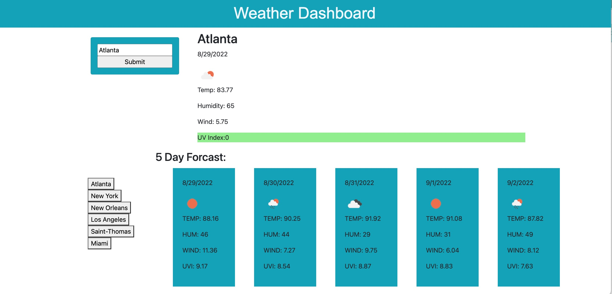

# Weather Dashboard

## Description
[Deployed Site](https://dstelzl.github.io/weather-dashboard/)

The Weather Dashboard Application provides Daily and a 5-day forcast for any city input into the search bar. The forcast includes temperature, wind speed, humidity and the UV index as well as an icon based on the conditions. The UV index is color coded green for a rating of 0-3, yellow for 4-7, and red for 8+. Previous searches are stored locally and are retrievable using a button below the search bar identified by the city name. All of the data comes from the Open Weather API service.

## Visuals

## Contributors
Created by Deborah Stelzl

